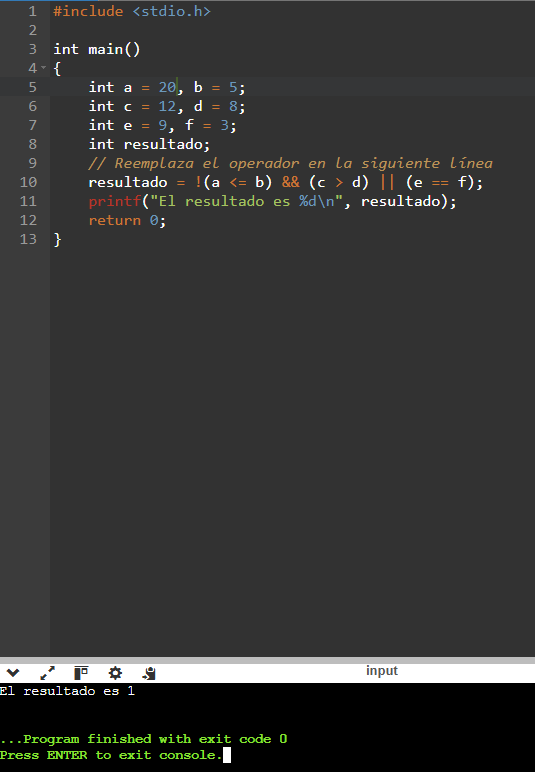
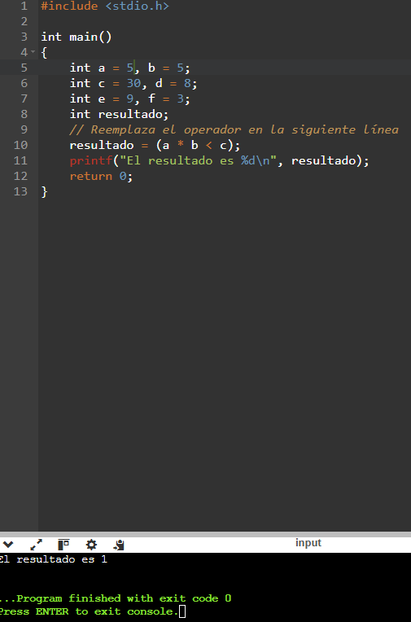
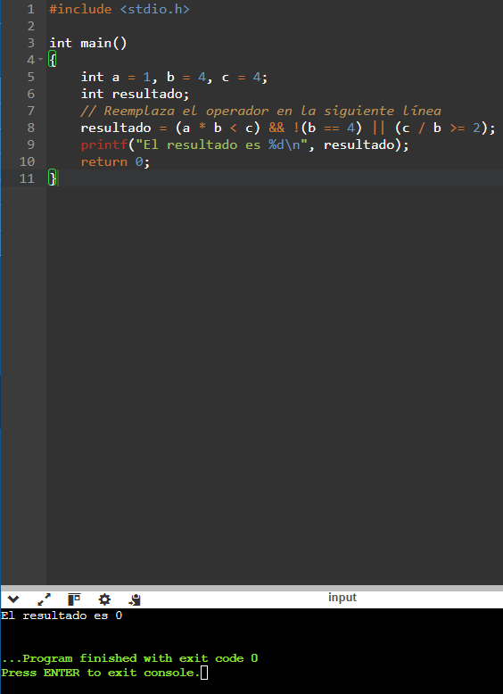
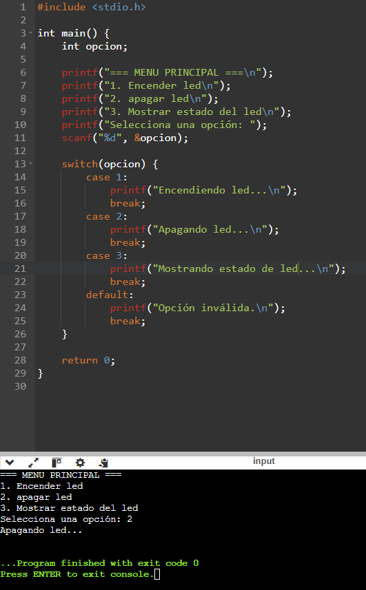
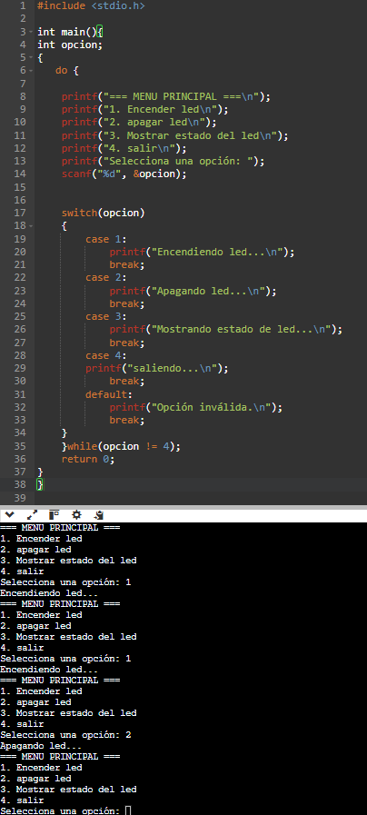

# 4. Actividad: Probando Operadores Relacionales

 # 8. Ejercicio con switch
 **Tarea**: Crea un programa que presente un menú similar al ejemplo anterior, pero que muestre:

- **Opción 1**: "Encender LED"
- **Opción 2**: "Apagar LED"
- **Opción 3**: "Mostrar estado del LED"
- **Opción 4**: Salir

# 9. Menu repetitivo con Bucle.

# 10. Ejercicios Propuestros