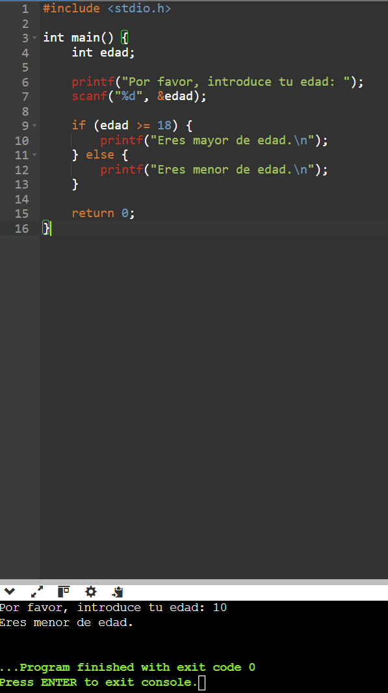
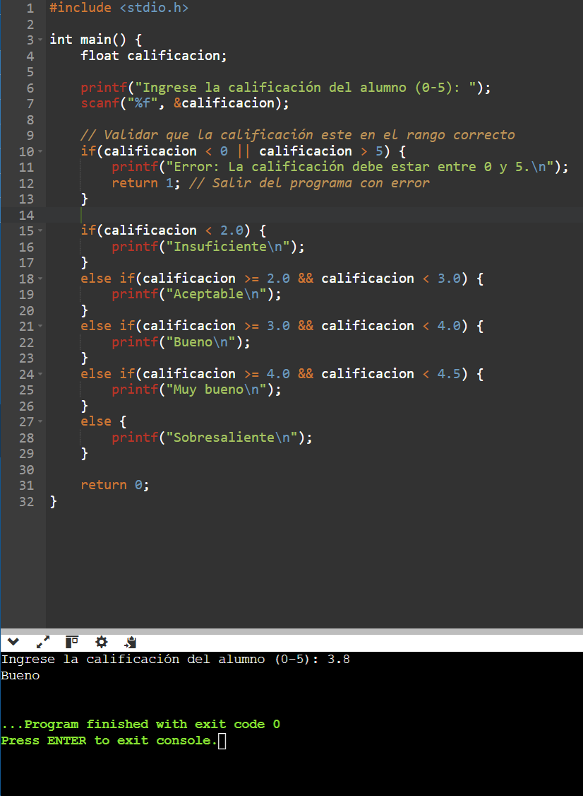
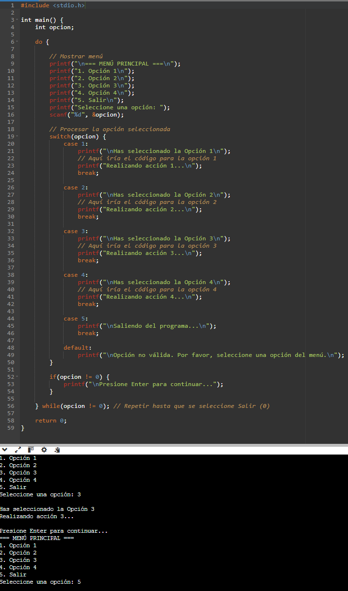

# 4. Actividad: Probando Operadores Relacionales

 # 8. Ejercicio con switch
 **Tarea**: Crea un programa que presente un menú similar al ejemplo anterior, pero que muestre:

- **Opción 1**: "Encender LED"
- **Opción 2**: "Apagar LED"
- **Opción 3**: "Mostrar estado del LED"
- **Opción 4**: Salir

# 9. Menu repetitivo con Bucle.

# 10. Ejercicios Propuestros
1. **Condicional doble**: Escribe un programa que pregunte la edad y te indique si eres mayor o menor de edad.

2. **`if-else if-else`**: Crea un programa que evalúe la calificación de un alumno (0-5) e imprima: "Insuficiente", "Aceptable", "Sobresaliente", etc.

3. **Menú repetitivo**: Implementa un menú con al menos **cuatro** opciones y un bucle que permita seleccionar repetidamente cualquier opción hasta que se elija "Salir".

