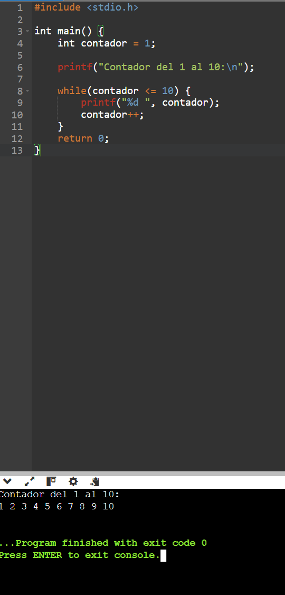
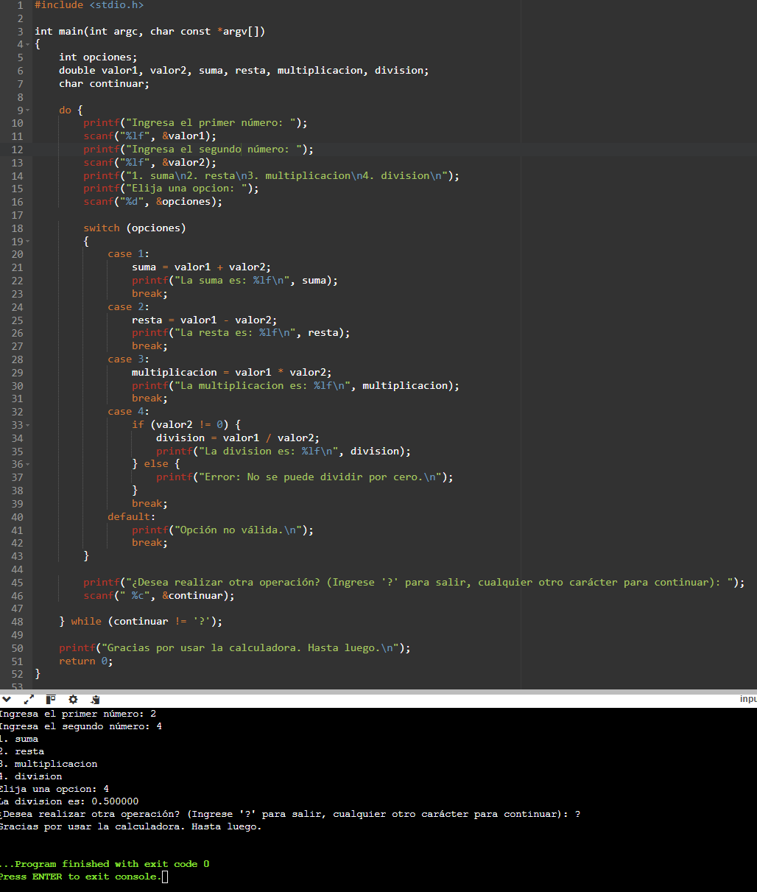
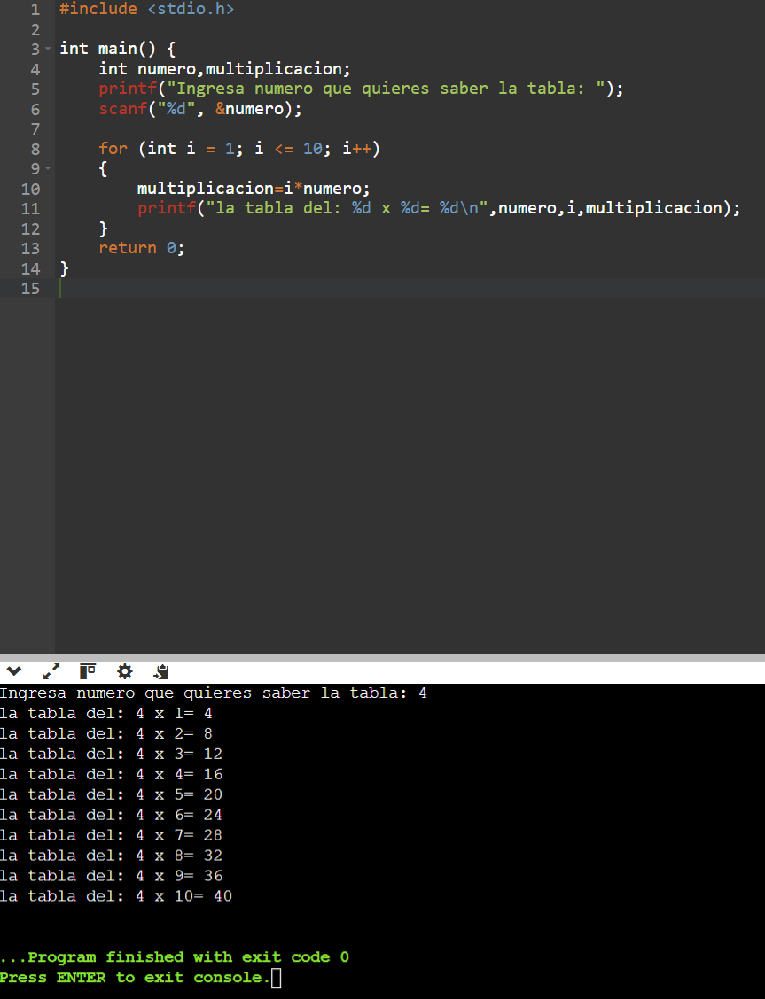
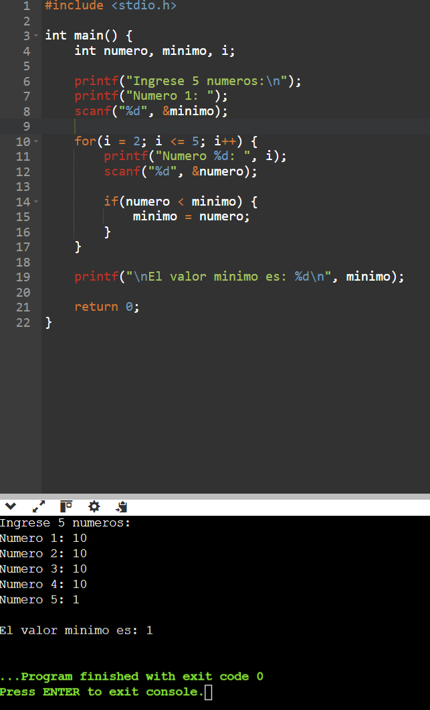
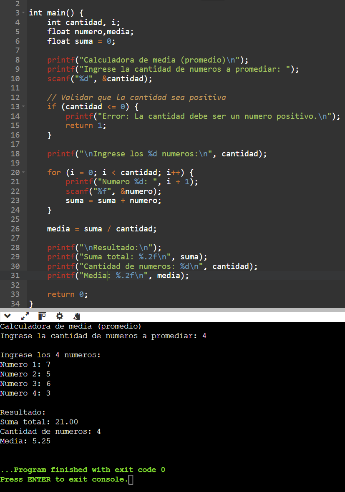

# 2. Bucle while
**ℹ️ Pregunta de Control**

1. ¿Qué sucedería si `contador++` estuviera fuera del bucle?
__Se crea un bucle infinito donde la unica iteracion es 1 porque el contador no para de contar este mismo numero pero no suma mas de 1__
2. ¿Qué pasa si nunca se cumple la condición dentro del `while`?
__El programa a pesar de que se ejecuta no funciona porque la condicion no se cumple entonces el bucle no arranca y se sale de este mismo__

# 3. Bucle do-while
**ℹ️ Pregunta de Control**

1. ¿Por qué el bloque de instrucciones se ejecuta **siempre** al menos una vez?
__Es porque la condicion siempre se evalua al final del bloque de codigo__
2. ¿Qué diferencia ves con `while`?
__While hace indefinidamente un codigo hasta que se cumpla una condicion mientras que do-while ejecuta un codigo primero y despues comprueba la condicion y verifica si se repite o no el do__

# 6. Ejercicios Propuestos
1. **Contador de 1 a 10 con `while`**
    - Muestra por pantalla los números del 1 al 10 usando un bucle `while`.

2. **Menú Interactivo con `do-while`**
    - Muestra un menú de opciones (e.g., "Sumar", "Restar", "Salir").
    - Utiliza `do-while` para que el menú aparezca **al menos una vez**.
    - Pide al usuario que seleccione una opción y ejecuta la acción correspondiente.

3. **Tablas de Multiplicar con `for`**
    - Crea un programa que muestre la tabla de multiplicar de un número ingresado.
    - Utiliza un bucle `for` para iterar desde 1 hasta 10.

4. **Búsqueda de Mínimo con `for`**
    - Pide al usuario que ingrese 5 números.
    - Encuentra y muestra el **valor mínimo** usando un bucle `for`.

5. **Ejemplo Avanzado**: Calcular la **media** (promedio) de un conjunto de números usando `while` o `for`.
__Si no hacía suma=0 me daba valores incorrectos__

