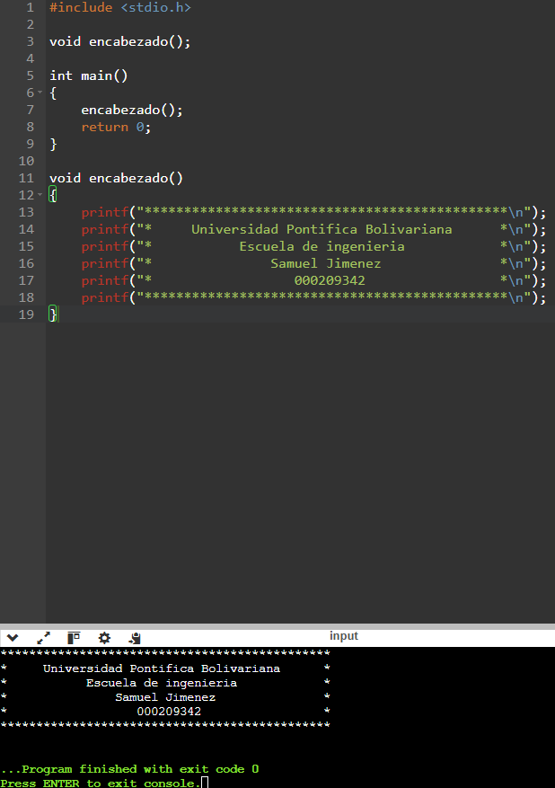

# 9. Preguntas de control de compresion
1. ¿Para qué sirve un prototipo de función?
__Sirven para definir el tipo de valores que la funcion va a devolver ademas de declarar la misma funcion.__
2. ¿Cuál es la diferencia entre parámetros y argumentos?
__Los parametros son los valores que una funcion espera recibir como variables o valores fijos y los argumentos son los valores que se van a pasar a la funcion y estos no son definidos__
3. ¿Qué sucede si no incluyes el archivo de cabecera de una función de biblioteca estándar?
__simplemente el codigo no me va ejecutar si en mi codigo uso una funcion de una biblioteca que no tengo__
4. ¿Por qué `main()` es especial en C?
__Es el punto de entrada de todo codigo en C ademas de ser la primer cosa en ejecutarse del codigo__
5. ¿Qué ocurre si una función no retorna ningún valor?
__Esto es una funcion void y los valores de esta no se reutilizan en alguna otra parte de un codigo y sirven mas para mostrarle al usuario un resultado ya que este no se vuelve a utilizar__

# 10. Ejercicios Propuestos

1. **Crear una función sin parámetros**
    - Escribe una función que imprima en pantalla un mensaje de texto que le pases desde la función `main()`.
    - Llama a esa función desde `main()`.
    

2. **Funciones de biblioteca**
    - Utiliza la función `sqrt()` de la biblioteca `<math.h>` para calcular la raíz cuadrada de un número ingresado por el usuario.
    - Verifica que el número sea positivo; si es negativo, muestra un mensaje de error.
3. **Pasar parámetros**
    - Crea una función que reciba dos números y devuelva el **máximo** de ambos.
    - Muestra el resultado en `main()`.
4. **Funciones en archivos separados**
    - Crea un archivo `.c` que defina una función `restar(int a, int b)`.
    - Crea otro archivo `.h` que contenga el prototipo de `restar()`.
    - En tu `main.c`, incluye el `.h`, llama a `restar()` y muestra el resultado.
5. **Funciones Recursivas (Tema Avanzado)**
    - Crea una función `factorial(int n)` que calcule el factorial de `n` usando recursividad.
    - Añade una condición para terminar la recursión cuando `n <=`