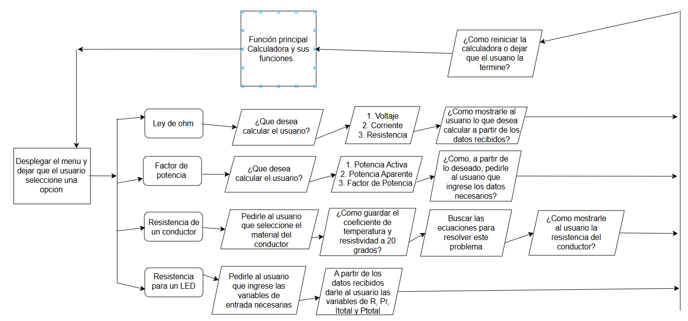

# Instrucciones
## - Analisis del problema
- El reto consiste en hacer una calculadora que tenga un menu con 4 opciones que son: 1. Ley de ohm 2. Calculo de factor de potencia 3. Resistencia de un conductor 4. Resistencia para un LED
## - Descomponer el problema en pequeñas partes
Las pequeñas partes del problema vendrian a ser cada funcion de la calculadora por separado para poder analizar estas respectivas partes una por una de forma mas detenida.
### - Representar las partes del problema de forma grafica

## - Para cada parte del problema extraer las partes relevantes
### - Variables de entrada
#### 1. Ley de ohm: 1. Voltaje 2. Corriente 3. Resistencia
#### 2. Factor de potencia: 1. Fp 2. Angulo 
#### 3. Resistencia de un Conductor: 1. Coeficiente de Temperatua 2. Material del conductor 3. Resistividad a 20 grados
#### 4. Resistencia para un LED: 1. Voltaje 2. # de ledes que se van a conectar en el circuito 3. Tipo de conexion de los ledes 4. Tension nominal del LED 5. Corriente nominal del LED. 
### - Variables de salida
#### 1. Ley de ohm: 1. Tension 2. Corriente 3. Voltaje
#### 2. Factor de Potencia: 1. Fp 2. Angulo
#### 3. Resistencia de un Conductor: 1. La resistencia del conductor
#### 4. Resistencia para un LED: 1. Valor de la Resistencia 2. Potencia de la resistencia 3. Potencia Total del circuito 4. Corriente total suministrada por la fuente.
### - Constantes
Solo habrían constantes en la resistencia de un conductor donde los materiales oro, aluminio y cobre deben de tener sus constantes de coeficientes de temperatura y resistividad a 20 grados fija.
### - Ecuaciones
#### 1. Ley de ohm: $V=IR$
#### 2. Factor de potencia: $Fp=cos(phi)$
#### 3. Resistencia de un Conductor:
 $R= R_0[1+a(t-t_0)]$ donde R es la resistencia a la temperatura $t$.

$R_0$ es la resistencia a la temperatura de referencia $20°C$.

t es la temperatura a la que queremos calcular el valor de la resistencia.

$t_0$ es $20°C$

#### 4. Resistencia para un LED: 

$V_r=V_i-Vled$

$V_i=Vled+V_r$ donde $Vi$ es la tension de alimentacion.

$Vled$ es el voltaje en el led.

$V_r$ es voltaje en la resistencia.

$R=V_r/I_t$ Donde $I_t$ es la corriente en la resistencia, $R$ el valor de la resistencia.

$P_t=V_i*I_t$

Donde $P_t$ es la potencia total, $V_i$ es el voltaje de la fuente, $I_t$ es la corriente en la resistencia.

$P_r=R*(I_t)^2$

Donde $R$ es el valor de la resistencia, $(I_t)^2$ es la corriente en la resistencia y $P_r$ es la potencia en la resistencia.

### - Estructuras de control